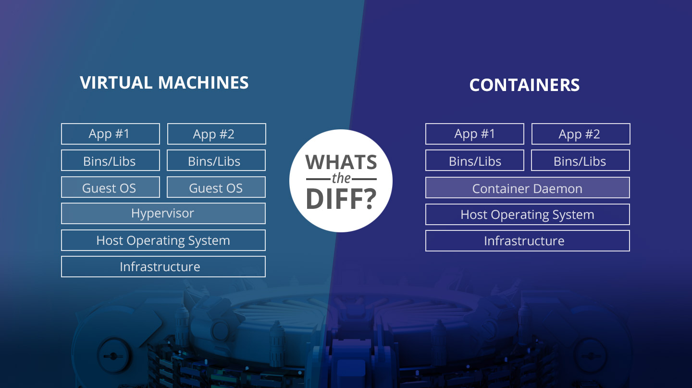

*This project has been created as part of the 42 curriculum by Maryna Peshko, intraname mpeshko.*

# Inception

## **Description**
TODO: This section clearly presents the project, including its goal and a brief overview.

For more info: [subject](https://github.com/MariPeshko/Inception_DockerCompose_for_LEMP_stack/blob/main/Inception_5.2_en.subject.pdf).

## **Instructions**
This section contains any relevant information about compilation, installation, and/or execution.

## **Virtual Machines vs Docker**



Source: [Azedine Ouhadou](https://github.com/azedineouhadou)
---

## **Secrets vs Environment Variables**

#### Environment Variables (what I did in this project)
- **How it works:** You create a single `.env` file where all your secrets are stored as environment variables (`KEY=VALUE`). Docker Compose reads this file and passes these variables into the containers. Your application (e.g., the `docker-entrypoint.sh` script) reads these environment variables (e.g., `${MYSQL_PASSWORD}`).
- **Advantages:** Very easy to set up and use. It is a common standard for development.
- **Disadvantages:** Environment variables can be visible if someone gains access to the container and runs the `env` or `docker inspect` command.

#### Docker Secrets
- **How it works:** Each secret is stored in a separate file (for example, the database password in db_password.txt). In docker-compose.yml, you tell Docker that these files are “secrets.” Docker mounts these files inside the container into a special temporary directory in memory (/run/secrets/). Your application must read the contents of these files to obtain the secret.
- **Example in docker-compose.yml:**
```bash
services:
  mariadb:
    # ...
    secrets:
      - db_password
      - db_root_password

secrets:
  db_password:
    file: ./secrets/db_password.txt
  db_root_password:
    file: ./secrets/db_root_password.txt
```
- **Advantages:** Considered more secure. Secrets are not stored in environment variables and do not end up in logs as easily. They only exist as files in a temporary file system in the container's memory.
- **Disadvantages**: Slightly more difficult to configure.

---

## **Docker Network vs Host Network**

TODO

## **Docker Volumes vs Bind Mounts**

Both **Docker volumes** (Named Volumes) and **bind mounts** allow container data to persist, but they operate quite differently. Docker volumes are the preferred method, where Docker creates and manages a dedicated storage area on the host filesystem, completely isolated from the host's core files. This makes volumes ideal for production as they are platform-independent and can be safely managed through the Docker CLI. You can create, list, and remove volumes without knowing their exact location on the host machine.

Docker Volume example.

You tell Docker, "Create an object called mariadb_data. Where you put it is up to you, just give me access to it." Who is in charge: Docker. It creates the folder itself (usually in `/var/lib/docker/volumes/`), sets the correct access rights itself.

```bash
# Docker will create the 'db_data' volume itself if it doesn't exist
docker run -d --name mariadb 
  --env-file .env \
  -v db_data:/var/lib/mysql \
  my_mariadb
```

In contrast, a bind mount links a specific file or directory from your host machine directly into a container. The host file dictates the content, and any changes on the host are immediately reflected inside the container. This makes bind mounts perfect for development, such as when you want to edit source code on your host and see the changes live in the container.

Bind Mounts example:
```bash
docker run -d --name wordpress --network test_network \
  --env-file .env \
  -v /home/mpeshko/data/wordpress:/var/www/html \
  my_wordpress
```

You are explicitly telling Docker: *"Take this specific folder on my computer `/home/mpeshko/data/mariadb` and push it into the container."*

In the Inception project, Bind Mounts are prohibited because the project should be as isolated as possible and independent of the folder structure of a particular user.

**Why do you see device: /home/mpeshko/data/wordpress in Inception?**

This is a **"hybrid" approach**. It's a Named Volume that is configured to store data in a specific location (via `driver_opts`). Technically it's still a Named Volume, but with a hard-link.

---

## **Resources**
TODO: section listing classic references related to the topic (documentation, articles, tutorials, etc.), as well as a description of how AI was used — specifying for which tasks and which parts of the project.

- [Manual for Oracle Virtual Box for virtual machine](https://www.virtualbox.org/manual/ch01.html)
- [Shared Folder in VM](https://www.virtualbox.org/manual/ch03.html#shared-folders)
- [Drag and Drop in VM](https://www.virtualbox.org/manual/ch04.html)
- [Guest Additions](https://www.virtualbox.org/manual/ch04.html)

Gemini chat in a browser - to research and to debug.

## Table of Contents
- [1. The VM](#1-the-vm)
	- [1.1. VM Creation](#11-vm-creation)
	- [1.2. Installation](#12-installation)
	- [1.3. VM Setup](#14-vm-setup)
		- [1.3.1. Add User as Sudo](#131-add-user-as-sudo)
		- [1.3.2. Shared Clipboard and Folders](#132-shared-clipboard-and-folders)
		- [1.3.3. Install Docker](#133-install-docker)
		- [1.3.4. Install make and hostsed](#134-install-make-and-hostsed)

## 1. The VM

### 1.1. VM Creation
1. Download image of [Debian](https://cdimage.debian.org/cdimage/release/13.3.0/amd64/iso-cd/). I chose the latest stable debian-13.3.0-amd64-netinst.iso (January, 2026).

*What is a netinst image?*
The netinst CD here is a small CD image that contains just the core Debian installer code and a small core set of text-mode programs (known as "standard" in Debian).

2. I use Oracle Virtual Box for virtual machine.
3. Settings: 4GB Memory, 4 processors, Enable EFI. Enables Extensible Firware Interface (EFI) booting for the guest OS; 29GB HardDisk. I enable EFI The Extensible Firmware Interface (EFI), officially known as the Unified Extensible Firmware Interface (UEFI), is a modern software interface that has replaced the traditional BIOS.
4. VM settings > System:
- I disable Audio
- Display: 128 Mb
- Graphic Controller VMSVGA (Use this graphics controller to emulate a VMware SVGA graphics device. This is the default graphics controller for Linux guests.)
- Enable 3D Acceleration for better UI responsiveness.
5. Network is set to NAT (Network Address Translation) mode. This way the guest can connect to the outside world using the host's networking and the outside world can connect to services on the guest which you choose to make visible outside of the virtual machine.

### 1.2. Installation
1. When starting the VM, choose Graphical Install.
2. A domain name is a human-friendly address, like google.com, that identifies a website on the internet, replacing complex numerical IP addresses (e.g., 192.0.2.2) and acting as a unique, memorable identifier for online services like websites and email.
3. In the partition menu - Partitioning method: `Guided - use entire disk and set up LVM`
4. Only / root (no partition needed).
5. Amount of volume group to use for guided partitioning: 27GB
6. Software selection: Ssh and GNOME. Probably, it's better lightweigh XFCE. It's a great choice for virtual machines because it uses very little RAM.

### 1.3. VM Setup

#### 1.3.1. Add User as Sudo

*Docker Permissions* : Later in this project, you will likely want to run Docker commands without typing sudo every single time (e.g., just docker-compose up instead of sudo docker-compose up). To do that, mpeshko will need to be part of the docker group.

*Security & Best Practice*: In a real-world LEMP setup, you never work as "root" directly. It’s too easy to delete a critical system file by mistake. You work as a normal user (mpeshko) and "escalate" to sudo only when needed.

*Path Accuracy*: Your project requires data to live in /home/mpeshko/data. If you do everything as the root user, you might accidentally create those folders with "root-only" permissions. Then, your WordPress container (running as a non-root user inside the container) might fail to write files to those folders, causing a "Permission Denied" error.

Switch to the Root user. Add your user to the sudo group. Install sudo (Just in case). Reboot.
```bash
su -
usermod -aG sudo mpeshko
apt update && apt install sudo
reboot
```

How to verify if you are already "Good to go":
```bash
groups
```
If you see sudo in the list, you are all set!

#### 1.3.2. Shared Clipboard and Folders

In the Settings window, under General, you can configure the most fundamental aspects of the virtual machine such as memory and essential hardware.

*Shared Clipboard.*  If you want to enable the copy and paste between the VM and your main PC, go to the `Device Settings > General -> General. Advanced tab -> Shared Clipboard > Bidirectional`. With this option, you can copy and paste text between the VM and your main PC.

*Drag and Drop.* Remain disabled.

**Shared Folder** improvement that makes your workflow much smoother.

Without a shared folder, your Virtual Machine (VM) is like a computer in a locked room. If you want to move a file (like a configuration script or a piece of code) from your Ubuntu host to your Debian VM, you would have to use a USB drive, email it to yourself, or use GitHub.
A Shared Folder acts like a "bridge." It creates a folder that exists on both machines at the same time.

*Automatic Mounting.* If a mount point is not specified: Linux guest. Folders are mounted under the /media directory.

**VirtualBox Guest Additions** are special drivers for your VM. Think of them as the "software" that tells Debian how to talk to the VirtualBox hardware.

The Oracle VM VirtualBox Guest Additions for all supported guest operating systems are provided as a single CD-ROM image file which is called VBoxGuestAdditions.iso. This image file is located in the installation directory of Oracle VM VirtualBox. To install the Guest Additions for a particular VM, you mount this ISO file in your VM as a virtual CD-ROM and install from there.

Instruction:
1. In your main PC, create a folder in your home directory called `/shared`. This folder will be used to share files between your main PC and the VM.
2. In the `VirtualBox settings > Shared Folders`, add a new shared folder with the name shared and the path to the folder `“/home/mpeshko/shared”` that you created in your main PC and check the auto-mount.
3. In the menu of the `"Instance"` (the window where Debian is actually running) - `Devices` > select `insert Guest Additions CD image`.
4. Open the terminal in the CD folder and run the following command
```bash
sudo sh VBoxLinuxAdditions.run
sudo reboot
```
5. Set up the Permissions: add your user to the vboxsf group and define your user as owner of the shared folder.
```bash
sudo usermod -aG vboxsf your_user
# Fix permissions for the media folder
sudo chown -R your_user:users /media/ 
sudo reboot
```
6. Logout and login again to apply the changes. Now, you can see the shared folder in the `/media` folder as an external device.
```bash
ls /media
```
You should see a folder starting with `sf_` (for example, `sf_shared`). If you see it, you are officially "connected" to your Ubuntu host!

#### 1.3.3. Install Docker

Prepare the docker repository installation.

Since Debian is a very stable and secure OS, it doesn't trust just any software you download from the internet. You have to prove to Debian that the Docker files are authentic.

#### Add Docker's official GPG key:
```bash
sudo apt-get update
sudo apt-get install ca-certificates curl gnupg
```

#### The "Security Guard" (GPG Key)
Docker "signs" its software with a digital signature (GPG key).
```bash
# Creates a secure folder to store these signatures.
sudo install -m 0755 -d /etc/apt/keyrings 

# Downloads Docker's public signature and converts it into a format Debian understands
curl -fsSL https://download.docker.com/linux/debian/gpg | sudo gpg --dearmor -o /etc/apt/keyrings/docker.gpg

sudo chmod a+r /etc/apt/keyrings/docker.gpg
```
Without this, anyone could pretend to be Docker and send you a virus. This key ensures that every piece of code you download is exactly what Docker intended to send.

#### Add the repository to Apt sources
Debian’s built-in "app store" (APT) usually contains an older version of Docker. This step tells your system: "Don't look in the standard Debian store; go directly to Docker's official warehouse."
```bash
echo \
  "deb [arch="$(dpkg --print-architecture)" signed-by=/etc/apt/keyrings/docker.gpg] https://download.docker.com/linux/debian \
  "$(. /etc/os-release && echo "$VERSION_CODENAME")" stable" | \
  sudo tee /etc/apt/sources.list.d/docker.list > /dev/null

sudo apt-get update
```

Then install docker and plugins
```bash
sudo apt-get install docker-ce docker-ce-cli containerd.io docker-buildx-plugin docker-compose-plugin
```
Now add your user to the docker group. It's important to use the docker commands without sudo.
```bash
sudo usermod -aG docker your_user
su - your_user
sudo reboot
```

Now check if the docker is working well with the following command:
```bash
docker run hello-world
```

#### 1.3.4. Install make and hostsed

**hostsed** - a tiny hosts file command line edit tool. It's a simple python tool for editing hosts file (default `/etc/hosts`), you can add or delete a DNS entry via command line shell (e.x. bash).

```bash
sudo apt-get install --yes make hostsed
```

---

